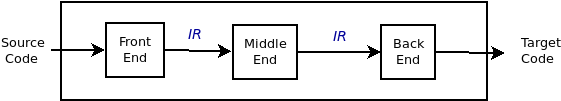
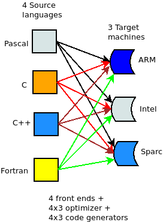
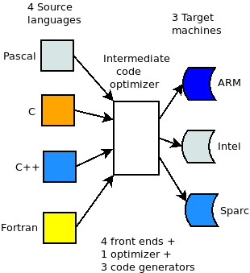
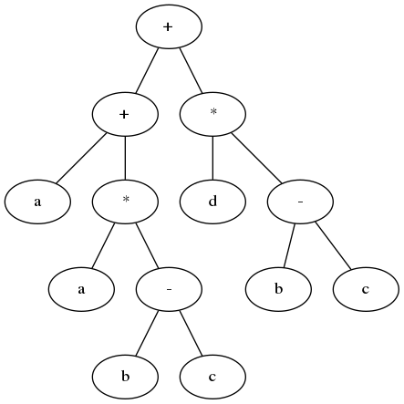
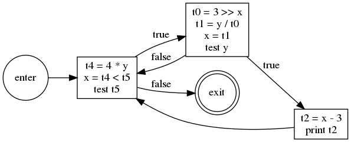
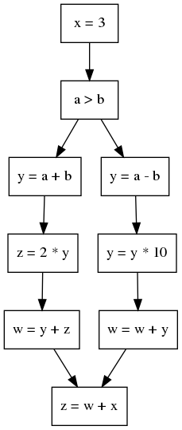
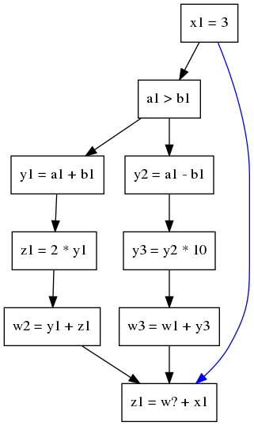
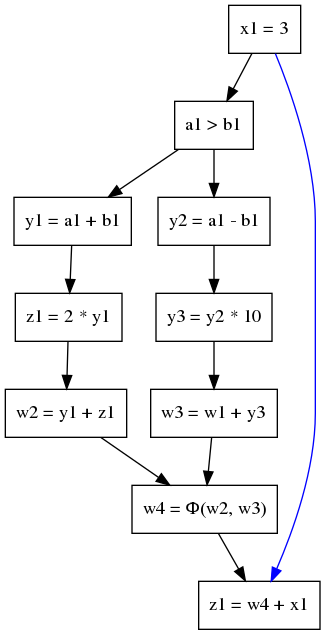

# **Agenda**

-   What is **Compiler Optimization**
-   History of **Compiler Optimization**
-   Types of **Compiler Optimization**
-   Factors affecting **Compiler Optimization**
-   Techniques of **Compiler Optimization**
-   Future scope
-   Intermediate Representation
-   LLVM IR

# **What Is Compiler Optimization**

-   What is **Compiler Optimization**
-   History of **Compiler Optimization**
-   Types of **Compiler Optimization**

## **What Is Compiler Optimization**

-   In computing, an **optimizing compiler** is a compiler that tries to minimize or maximize some attributes of an executable computer program.
-   *compiler optimization* = *code optimization*
-   Set of algorithms which transforms a program to an equivalent output program that uses fewer resources:
    -   minimizing program execution time
    -   minimizing memory use
    -   minimizing the power consumed by a program

## **History of Compiler Optimization**

-   One of the earliest notable optimizing compiler was that for BLISS (1970), which was described in The  Design of an Optimizing Compiler (1975)
-   By the 1980s optimizing compilers were sufficiently effective that programming in assembly language declined, and by the late 1990s for even sensitive code, optimizing compilers exceeded the performance of human experts.

## **Optimizations at Various Phases**

-   **Source Code**:
    -   **Algorithms transformations** can produce spectacular improvements.
    -   **Profiling** can be helpful to focus a programmer's attention on important code.
-   **Intermediate Code**:
    -   Compiler can improve loops, procedure calls and address calculations.
    -   Typically only optimizing compilers include this phase.
-   **Target Code**:
    -   Efficient choosing appropriate target-machine instructions.
    -   Efficient using registers.
    -   Peephole optimizations.
    -   Instruction scheduling.

## **Types of Compiler Optimization**

-   Peephole optimizations
-   Local optimizations
-   Global optimizations
-   Loop optimizations
-   Prescient store optimizations
-   Interprocedural, whole-program or link-time optimizations
-   Machine code optimizations

### **Peephole Optimizations**

-   Usually performed late in the compilation process after machine code has been generated. This form of optimization examines a few adjacent instructions to see whether they can be replaced by a single instruction or a shorter sequence of instructions.

### **Local Optimizations**

-   These only consider information local to a basic block. Since basic blocks have no control flow, these optimizations need very little analysis (saving time and reducing storage requirements), but this also means that no information is preserved across jumps.

### **Global Optimizations**

-   These are also called "intraprocedural methods" and act on whole function. This gives them more information to work with but often makes expensive computations necessary.

### **Loop Optimizations**

-   These act on the statements which make up a loop. Loop optimizations can have a significant impact because many programs spend a large percentage of their time inside loops.

### **Prescient Store Optimizations**

-   Allow store operations to occur earlier than would otherwise be permitted in the context of threads and locks. The process needs some way of knowing ahead of time what value will be stored by the assignment that it should have followed.

### **Interprocedural, Whole-Program or Link-Time Optimizations**

-   These analyze all of a program's source code. The greater quantity of information extracted means that optimizations can be more effective compared to when they only have access to local information.

### **Machine Code Optimizations**

-   These analyze the executable task image of the program after all of an executable machine code has been linked. Some of the techniques that can be applied in a more limited scope, such as macro compression are more effective when the entire executable task image is available for analysis.
-   In addition to scoped optimizations there are two further general categories of optimization:
    -   Programming language-independent vs language-dependent
    -   Machine independent vs machine dependent

### **Programming Language-Dependent VS Language-Independent**

-   Most high-level languages share common programming constructs and abstractions: decision (`if`, `switch`, `case`), looping (`for`, `while`, `repeat`&#x2026;~until~, `do`&#x2026;~while~), and encapsulation (structures, objects).
-   However, certain language features make some kinds of optimizations difficult. For instance, the existence of pointers in `C` and `C++` makes it difficult to optimize array accesses.

### **Machine Independent VS Machine Dependent**

-   Many optimizations that operate on abstract programming concepts (loops, objects, structures) are independent of the machine targeted by the compiler, but many of the most effective optimizations are those that best exploit special features of the target platform. E.g.: Instruction which do several things at once, such as decrement register and branch if not zero.

## **Factors Affecting Compiler Optimization**

-   The machine itself.
-   The architecture of the target CPU.
-   The architecture of the machine.
-   Intended use of the generated code.

### **The Machine Itself**

-   Many of the choices about which optimizations can and should be done depend on the characteristics of the target machine.
-   It is sometimes possible to parameterize some of these machine dependent factors, so that a single piece of compiler code can be used to optimize different machines just by altering the machine description parameters.

### **The Architecture of the Target CPU**

-   RISC vs CISC
-   Pipelines
-   Number of functional units

### **The Architecture of the Machine**

-   Techniques such as inline expansion and loop unrolling may increase the size of the generated code and reduce code locality.
-   Cache/Memory transfer rates: These give the compiler an indication of the penalty for cache misses.
-   This is used mainly in specialized applications.

### **Intended Use of the Generated Code**

-   Debugging
-   General purpose use
-   Special-purpose use
-   Embedded systems

-   **Debugging**

    -   While writing an application, a programmer will recompile and test often, and so compilation must be fast.

-   **General Purpose Use**

    -   Prepackaged software is very often expected to be executed on a variety of machines and CPUs that may share the same instruction set, but have different timing, cache or memory characteristics.

-   **Special-Purpose Use**

    -   If the software is compiled to be used on one or a few very similar machines, with known characteristics, then the compiler can heavily time the generated code to those specific machines.

-   **Embedded Systems**

    -   Embedded software can be tightly tuned to an exact CPU and memory size. So, for example, compilers for embedded software usually offer options that reduce code size at the expense of speed, because memory is the main cost of an embedded computer.

## **Future Scope**

-   Artifical intelligence will detect all the code which can be optimized.

# **Techniques of Compiler Optimizations**

-   [Compiler Optimizations](http://compileroptimizations.com/)

## **Instruction Combining**

    int i;
    void f()
    {
      i++;
      i++;
    }

    int i;
    void f()
    {
      i += 2;
    }

## **Constant Folding**

    int f()
    {
      return (3 + 5);
    }

    int f()
    {
      return 8;
    }

## **Constant Propagation**

    void f()
    {
      x = 3;
      y = x + 4;
    }

    void f()
    {
      x = 3;
      y = 7;
    }

## **Common SubExpression (CSE) Elimination**

    void f()
    {
      i = x + y + 1;
      j = x + y;
    }

    void f()
    {
      t1 = x + y;
      i = t1 + 1;
      j = t1;
    }

## **Integer Multiply Optimization**

    int f(int i)
    {
      return i * 4;
    }

    int f(int i)
    {
      return i << 2;
    }

## **Integer Divide Optimization**

    int f(int i)
    {
      return i / 2;
    }

    int f(int i)
    {
      return i >> 1;
    }

## **Loop Fusion**

    void f()
    {
      int i;
      for (int i = 0; i < 100; i++)
        a[i] += 10;
      for (int i = 0; i < 100; i++)
        b[i] += 10;
    }

    void f()
    {
      int i;
      for (int i = 0; i < 100; i++) {
        a[i] += 10;
        b[i] += 10;
      }
    }

## **Dead Code Elimination**

    int global;
    void f()
    {
      int i;
      i = 1;      // dead store
      global = 1; // dead store
      global = 2;
      return;
      global = 3; // unreachable
    }

    void f()
    {
      global = 2;
      return;
    }

## **Redundant Code Elimination**

    {
      if (1 < 2) {
        printf("i is smaller than 2");
      } else {
        printf("math is broken");
      }
    }

    {
      printf("i is smaller than 2");
    }

## **Expression Simplification**

    void f(int i)
    {
      a[0] = i + 0;
      a[1] = i * 0;
      a[2] = i - i;
      a[3] = 1 + i + 1;
    }

    void f(int i)
    {
      a[0] = i;
      a[1] = 0;
      a[2] = 0;
      a[3] = 2 + i;
    }

## **Forward Store**

    int sum;
    void f()
    {
      sum = 0;
      for (int i = 0; i < 100; i++) {
        sum += a[i];
      }
    }

    int sum;
    void f()
    {
      register int t = 0;
      for (int i = 0; i < 100; i++) {
        t += a[i];
      }
      sum = t;
    }

## **Loop Invariant Code Motion**

    #define BLACK 1
    struct Triangle {...};
    struct Triangle *triangle[];
    {
      int color;
      for (int i = 0; i < 100; i++) {
        color = BLACK;
        Draw(t, color);
      }
    }

    #define BLACK 1
    struct Triangle {...};
    struct Triangle *triangle[];
    {
      int color = BLACK;
      for (int i = 0; i < 100; i++) {
        Draw(t, color);
      }
    }

## **If Optimization**

    void f(int *p)
    {
      if (p)
        g(1);
      if (p)
        g(2);
    }

    void f(int *p)
    {
      if (p) {
        g(1);
        g(2);
      }
    }

## **If Optimization**

    void f(int *p)
    {
      if (p) {
        g(1);
        if (p)
          g(2);
    }

    void f(int *p)
    {
      if (p) {
        g(1);
        g(2);
      }
    }

## **`new` Expression Optimization**

    {
      int a[];
      a = new int[100];
    }

    {
      // a not used, so not allocated
    }

## **`try...catch` Block Optimization**

    try
    {
      a = (int)5;
    }
    catch (Exception e)
    {
      //
    }

    a = 5;

## **Loop Unrolling**

    for (int i = 0; i < 100; i++) {
      g();
    }

    for (int i = 0; i < 100; i += 2) {
      g();
      g();
    }

## **Unswitching**

    for (int i = 0; i < 100; i++) {
      if (x)
        a[i] = i;
      else
        b[i] = i;
    }

    if (x) {
      for (int i = 0; i < 100; i++) {
        a[i] = i;
      }
    } else {
      for (int i = 0; i < 100; i++) {
        b[i] = i;
      }
    }

## **Induction Variable Elimination**

    int a[SIZE];
    int b[SIZE];
    
    void f (void)
    {
      int i1, i2, i3;
    
      for (i1 = 0, i2 = 0, i3 = 0; i1 < SIZE; i1++)
        a[i2++] = b[i3++];
      return;
    }

    int a[SIZE];
    int b[SIZE];
    
    void f (void)
    {
      int i1;
    
      for (i1 = 0; i1 < SIZE; i1++)
        a[i1] = b[i1];
      return;
    }

## **Strength Reduction**

    int s = 0, v = 0;
    for (int i = 0; i < n; i++) {
      v = 4 * i;
      s = s + v;
    }

    int s = 0, v = 0;
    for (int i = 0; i < n; i++) {
      v = v + 4;
      s = s + v;
    }

## **Function Inlining**

    int add (int x, int y)
    {
      return x + y;
    }
    
    int sub (int x, int y)
    {
      return add (x, -y);
    }

    int sub (int x, int y)
    {
      return x - y;
    }

# **Intermediate Representation**

-   An **Intermediate Representation** is a representation of a program “between” the source and target languages. A good IR is one that is fairly independent of the source and target languages, so that it maximizes its ability to be used in a retargetable compiler.
-   Is translated from an **Abstract Syntax Tree** of a program.
-   It should **be easy to produce**.
-   It should **be easy to translate** to target machine code.

## **Why Use an IR?**

-   If a compiler translates the source language to its target machine language without having the option for generating intermediate code, then for each new machine, a full native compiler is required.
-   Because translation appears to *inherently* require analysis and synthesis. Intermediate code eliminates the need of a new full compiler for every unique machine by keeping the analysis portion same for all the compilers.
-   To break the difficult problem of translation into simpler, more manageable pieces.

## **Why Use an IR?**

-   To build retargetable compilers:
    -   We can build new backends for existing front-end (making the source language more *portable across machines*)
    -   We can build a new front-end for an existing back-end (so a new machine can quickly get a set of compilers for different source languages).
    -   We only have to write *2n* half-compilers instead of *n(n-1)* full compilers.
-   To perform *machine independent* optimizations. It becomes easier to apply the source code modifications to improve code performance by applying code optimization techniques on the intermediate code.

## **Why Use an IR?**

## **Why Use an IR?**

-   Ideally, details of the source language are confined to the front end, and details of the target machine to the back end.

## **Intermediate Representations**

-   Decision in *IR* design affect speed and efficiency of the compiler
-   Some important *IR* properties
    -   Ease of generation
    -   Ease of manipulation
    -   Procedure size
    -   Freedom of expression
    -   Level of abstraction
-   The importance of different properties varies between compilers
    -   Selecting anappropriate *IR* for a compiler is critical

## **Level of Abstraction: High**

-   Operands look a lot like the source language, with structured objects like arrays and structs.
-   Keep structure of source language program explicit
-   Source program can be reconstructed from it
-   Operands are semantic objects, including arrays and structs
-   No breaking down of array indexing computations
-   No thought of registers
-   No concern for runtime systems

## **Level of Abstraction: Medium**

-   There are no structured objects, but still target language independent
-   Can be source or target oriented
-   Language and machine independent
-   Break down data structure references to deal only with simple integers and floats
-   Great for architecture-independent optimizations

## **Level of Abstraction: Low**

-   Operands are extremely close to target machine
-   Architecture dependent
-   Deviates from target language only in its inclusion of pseudo-operations and symbolic (virtual) registers
-   Inimately concerned with run-time storage management issues like stake frames and parameter passing
-   Used for architecture dependent optimizations

## **Memory Models**

-   Two major **Memory Models**:
    -   **Register-To-Register Model**
        -   Keep all values that can legally be stored in a register in registers
        -   Ignore machine limitations on number of registers
        -   Compiler back-end must insert loads and stores
    -   **Memory-To-Memory Model**
        -   Keep all values in memory
        -   Only promote values to registers directly before they are used
        -   Compiler back-end can remove loads and stores

## **Styles of IR**

-   Intermediate representations are usually:
    -   Structural
    -   Flat, tuple-based, generally three-address code
    -   Flat, stack-based
    -   Or any combination of the above three

## **Structural IR**

-   Graphically oriented
-   Heavily used in source-to-source translators
-   Tend to be large
-    Examples: Trees

## **Linear IR**

-   Pseudo-code for an abstract machine
-   Level of abstraction varies
-   Simple, compact data structures
-   Easier to rearrange
-    Examples: 3 address code

## **Hybrid IR**

-   Combination of graphs and linear code
-   Attempt to take best of each
-    Examples: Control Flow Graph

## **Abstract Syntax Tree**

-   An **Abstract Syntax Tree (AST)** is a way of representing the syntax of a programming language as a hierarchical tree-like structure. This structure is used for generating symbol tables for compilers and later code generation. The tree represents all of the constructs in the language and their subsequent rules. AST is the procedure's parse tree.
-   For ease of manipulation, can use a linearized (operator) form of the tree: \(x - 2*y\) \(\rightarrow\) \(x 2 y *\) - postfix form

## **Directed Acyclic Graphs (DAGs)**

-   *Directed Acyclic Graph* (DAG) is a variant of *Abstract Syntax Tree* (AST) where nodes are not duplicated and any given node may have more than one parent. It is very efficient at representing expressions and hence generate efficient code for the expression.
-   Example: \(a + a * (b - c) + (b - c) * d\)

## **Directed Acyclic Graphs (DAGs)**

-   The DAG can be built from the AST by doing a post-order traversal, constructing each node and linking to an existing node if the constructed already exists in the DAG, otherwise add the constructed node to the DAG

## **3-Address Code**

-   In *3-address code* there is at most one operator on the right-hand of an instruction and at most three names. Hence, in *3-address code*, the valid instructions for expressions are:
    -   *x = y op z*
    -   *x = op y*
    -   *x = op*
-   Complex expressions in the source language can be translated in a sequence of *3-address code* instructions.
-   *3-address code* is actually **linearized** version of an AST or DAG
-    Typicall statements types:
    -   **assignments**: *x = y op z*, *x = y[i]*
    -   **branches**: *goto L*, *if x relop y goto L*
    -   **procedure calls** and **procedure returns**: *param x, call p*, *return*
    -   **address and pointer assignments**: *x = &y*, *x = \*y*, *\*x = y*
    -   **indexed instructions**: *x[i] = y*, *x = y[i]*

## **3-Address Code**

-   An *Address* can be one of the following:
    -   **Name** - is a pointer to the symbol table entyr that corresponds to a source program name (variable)
    -   **Constant**
    -   **Temporary** - *compiler-generated temporaries* created as needed. They may be removed by different optimization phases. The remaining *temporaries* will be allocated to hardware registers if possible

## **3-Address Code**

-   
    -   Resembles many machines
    -   Introduces a new set of machines (the temp results)
    -   Compact form

## **Stack Machine Code**

-   Can simplify *IR* by assuming implicit stack:
    -   *z = x - 2 \* y* becomes

    push z
    push x
    push 2
    push y
    multiply
    substract
    store

-    Advantages:
    -   compact form
    -   introduced names are implicit, not explicit
    -   simple to generate and execute code
    -   useful where code is transmitted over slow communication links (the net)
-    Disadvantages:
    -   processors operate on registers, not stacks
    -   difficult to reuse values on the stack

## **3-Address Code: Quadruples**

-   *Quadruples* are a data structure for storing 3-address code instructions. Each *quadruple* or simply *quad*, has for elements:
    -   *op, arg1, arg2* and *result*
    -   In the case of instructions such as *x = y* and *x = op y*, *arg2* is not used
    -   In the case of instructions such as *param x1*, *arg2* and *result* are not used.
    -   In the case of *jump* instructions, the target label is put into *result*.
-   *Quadruples* is the native repesentation of *3-address code*:
    -   table of *k \* 4* small integers
    -   simple record structure
    -   easy to reorder
    -   explicit names

## **3-Address Code: Quadruples**

-   *a = b \* -c + b \* -c*
-   3-adress code

    t1 = minus c
    t2 = b * t1
    t3 = minus c
    t4 = b * t3
    t5 = t2 + t4
    a = t5

-   Quadruples

<table border="2" cellspacing="0" cellpadding="6" rules="groups" frame="hsides">

<colgroup>
<col  class="org-right" />

<col  class="org-left" />

<col  class="org-left" />

<col  class="org-left" />

<col  class="org-left" />
</colgroup>
<thead>
<tr>
<th scope="col" class="org-right">&#xa0;</th>
<th scope="col" class="org-left">*op*</th>
<th scope="col" class="org-left">*arg1*</th>
<th scope="col" class="org-left">*arg2*</th>
<th scope="col" class="org-left">*result*</th>
</tr>
</thead>

<tbody>
<tr>
<td class="org-right">0</td>
<td class="org-left">minus</td>
<td class="org-left">*c*</td>
<td class="org-left">&#xa0;</td>
<td class="org-left">*t1*</td>
</tr>

<tr>
<td class="org-right">1</td>
<td class="org-left">\*</td>
<td class="org-left">*b*</td>
<td class="org-left">*t1*</td>
<td class="org-left">*t2*</td>
</tr>

<tr>
<td class="org-right">2</td>
<td class="org-left">minus</td>
<td class="org-left">*c*</td>
<td class="org-left">&#xa0;</td>
<td class="org-left">*t3*</td>
</tr>

<tr>
<td class="org-right">3</td>
<td class="org-left">\*</td>
<td class="org-left">*b*</td>
<td class="org-left">*t3*</td>
<td class="org-left">*t4*</td>
</tr>

<tr>
<td class="org-right">4</td>
<td class="org-left">+</td>
<td class="org-left">*t2*</td>
<td class="org-left">*t4*</td>
<td class="org-left">*t5*</td>
</tr>

<tr>
<td class="org-right">5</td>
<td class="org-left">=</td>
<td class="org-left">*t5*</td>
<td class="org-left">&#xa0;</td>
<td class="org-left">*a*</td>
</tr>
</tbody>
</table>

## **3-Address Code: Triple**

-   With *quadruples* the *result* field is used to specify the *temporary* that holds the result of the instruction. *Triples* are an optimization (in terms of space) where we use the instruction's position to specify the *temporary* that will hold the result.

<table border="2" cellspacing="0" cellpadding="6" rules="groups" frame="hsides">

<colgroup>
<col  class="org-right" />

<col  class="org-left" />

<col  class="org-left" />

<col  class="org-left" />
</colgroup>
<thead>
<tr>
<th scope="col" class="org-right">&#xa0;</th>
<th scope="col" class="org-left">*op*</th>
<th scope="col" class="org-left">*arg1*</th>
<th scope="col" class="org-left">*arg2*</th>
</tr>
</thead>

<tbody>
<tr>
<td class="org-right">0</td>
<td class="org-left">minus</td>
<td class="org-left">*c*</td>
<td class="org-left">&#xa0;</td>
</tr>

<tr>
<td class="org-right">1</td>
<td class="org-left">\*</td>
<td class="org-left">*b*</td>
<td class="org-left">(0)</td>
</tr>

<tr>
<td class="org-right">2</td>
<td class="org-left">minus</td>
<td class="org-left">*c*</td>
<td class="org-left">&#xa0;</td>
</tr>

<tr>
<td class="org-right">3</td>
<td class="org-left">\*</td>
<td class="org-left">*b*</td>
<td class="org-left">(2)</td>
</tr>

<tr>
<td class="org-right">4</td>
<td class="org-left">+</td>
<td class="org-left">(1)</td>
<td class="org-left">(3)</td>
</tr>

<tr>
<td class="org-right">5</td>
<td class="org-left">=</td>
<td class="org-left">*a*</td>
<td class="org-left">(4)</td>
</tr>
</tbody>
</table>

-   The bracketed numbers are pointers to the *temporaries* associated with each entry in the *triple* structure.

## **3-Address Code: Triple**

-   In the case of copy instructions, *arg1* holds the receiving location and *arg2* holds the source location
-   In the case of jump instructions, *arg1* holds the condition and *arg2* holds the target label
-   Ternary operations, like \(x\)[\(i\)] = \(y\), require 2 entries in the triple structure:
    -   0 *op*:[], *arg1*:\(x\), *arg2*:\(i\)
    -   1 *op*:=, *arg1*:(0), *arg2*:\(y\)
-   Index is used as implicit name
-   25% less space consumed than quads
-   Much harder to reorder

## **3-Address Code: Indirect Triple**

-   In the subsequent optimization stage, *triples* cause complications as reordering the triples will result in a triple referring to the wrong *temporary*. The solution is to use another table to index into the *triple* structure

<table border="2" cellspacing="0" cellpadding="6" rules="groups" frame="hsides">

<colgroup>
<col  class="org-right" />

<col  class="org-left" />

<col  class="org-left" />

<col  class="org-left" />

<col  class="org-left" />

<col  class="org-right" />

<col  class="org-left" />
</colgroup>
<thead>
<tr>
<th scope="col" class="org-right">&#xa0;</th>
<th scope="col" class="org-left">*op*</th>
<th scope="col" class="org-left">*arg1*</th>
<th scope="col" class="org-left">*arg2*</th>
<th scope="col" class="org-left">&#xa0;</th>
<th scope="col" class="org-right">idx</th>
<th scope="col" class="org-left">ref</th>
</tr>
</thead>

<tbody>
<tr>
<td class="org-right">0</td>
<td class="org-left">minus</td>
<td class="org-left">*c*</td>
<td class="org-left">&#xa0;</td>
<td class="org-left">&#xa0;</td>
<td class="org-right">25</td>
<td class="org-left">(0)</td>
</tr>

<tr>
<td class="org-right">1</td>
<td class="org-left">\*</td>
<td class="org-left">*b*</td>
<td class="org-left">(0)</td>
<td class="org-left">&#xa0;</td>
<td class="org-right">26</td>
<td class="org-left">(1)</td>
</tr>

<tr>
<td class="org-right">2</td>
<td class="org-left">minus</td>
<td class="org-left">*c*</td>
<td class="org-left">&#xa0;</td>
<td class="org-left">&#xa0;</td>
<td class="org-right">27</td>
<td class="org-left">(2)</td>
</tr>

<tr>
<td class="org-right">3</td>
<td class="org-left">\*</td>
<td class="org-left">*b*</td>
<td class="org-left">(2)</td>
<td class="org-left">&#xa0;</td>
<td class="org-right">28</td>
<td class="org-left">(3)</td>
</tr>

<tr>
<td class="org-right">4</td>
<td class="org-left">+</td>
<td class="org-left">(1)</td>
<td class="org-left">(3)</td>
<td class="org-left">&#xa0;</td>
<td class="org-right">29</td>
<td class="org-left">(4)</td>
</tr>

<tr>
<td class="org-right">5</td>
<td class="org-left">=</td>
<td class="org-left">*a*</td>
<td class="org-left">(4)</td>
<td class="org-left">&#xa0;</td>
<td class="org-right">30</td>
<td class="org-left">(5)</td>
</tr>
</tbody>
</table>

-   The entries in the index table can be reordered without messing up the references to *temporaries*

## **Basic Block**

-   A **Basic Block** is maximal sequence of instructions with:
    -   no labels (except at the first instruction), and
    -   no jumps (except at the last instruction)
-   **Idea**:
    -   Cannot jump into a basic block (except at the beginning)
    -   Cannot jump out of a basic block (except at end)
    -   Each instruction in a basic block is executed after all the preceding instructions have been executed
-   Example:

    L:
      t = 2 * x;
      w = t + x;
      if (w > 0) goto L;

## **Basic Block**

-   A **Basic Block** is:
    -   a **maximal-length sequence of instructions** that will execute in its entirely
    -   a **maximal-length straight-line code block**
    -   a **maximal-length code block** with only one entry and one exit
-   &#x2026; in the abscence of hardware faults, interrupts, crashes, threading problems, etc
-   To locate **Basic Blocks** in flattened code:
    -   **Starts with**: (1) target of a branch (label) or (2) the instruction after a conditional branch
    -   **Ends with**: (1) a branch or (2) the instruction before the target of a branch

## **Control Flow Graph (CFG)**

-   a **Control Flow Graph (CFG)** is a data structure that represents the flow of control in an intermediate representation, such as 3-address code.
-   a **Control Flow Graph (CFG)** is a directed graph with
    -   basics blocks as **nodes**
    -   an **edge** from block A to block B if the execution can flow from the last instruction in A to the first instruction in B
    -   e.g., the last instruction in A is jump to \(L_{B}\)
    -   e.g., the the execution can fall-through from block A to block B
    -   the body of a method (or procedure) can be represented as CFG
        -   there is one **initial node** in a method (procedure) CFG
        -   all **"return"** nodes in a method (procedure) CFG are **terminal** nodes. Sometimes all **return** nodes can have additional edges (one for each) to the only **exit** terminal node
        -   conditional and unconditional **jumps** represent **edges** in a method (procedure) CFG

## **Control Flow Graph Example**

      goto L2;
    L1:
      t0 = 3 >> x;
      t1 = y / t0;
      x = t1;
      if (y == 0) goto L3;
      t2 = x - 3;
      print t2;
    L3:
    L2:
      t4 = 4 * y;
      x = t4 < t5;
      if (t5 != 0) goto L1;

## **Control Flow Graph Example**

## **Building Control Flow Graph**

-   To decompose a method (or procedure) into ***basic blocks*** first:
    -   Identify the ***Leaders***:
        -   the \(1^{st}\) instruction of a method (procedure)
        -   any instruction that is the target of a jump (conditional or unconditional); and
        -   any instruction immediately following a jump
    -   For each ***leader*** its *basic block* are all the subsequent instructions until the next ***leader***
    -   The jumps (conditional or unconditional) are always to ***leaders*** (i.e. the start of a ***basic block***) and these form the edges in the ***control flow graph***

## **Static Single Assignment (SSA)**

-   An *IR* is in ***Static Single Assignment (SSA)*** form if each variable (or temporary) is **assigned exactly once** and every variable (or temporary) is **assigned a value before** it is used
-   If a variable is used more than once then each use is assigned a separate variable, generally using subscripts to distinguish between them:
    -   \(p = a + b\) \(\rightarrow\) \(p_{1} = a + b\)
    -   \(q = p - c\) \(\rightarrow\) \(q_{1} = p_{1} - c\)
    -   \(p = q * d\) \(\rightarrow\) \(p_{2} = q_{1} * d\)
    -   \(p = e - p\) \(\rightarrow\) \(p_{3} = e - p_{2}\)
    -   \(q = p + q\) \(\rightarrow\) \(q_{2} = p_{3} + q_{1}\)

## **SSA Example**

## **SSA Example**

## **Static Single Assignment**

-   Add **SSA edges** from definitions to uses
    -   No intervening statements define variable
    -   Safe to propagate facts about variables only along edges

## **What About Joines?**

## **What About Joines?**

-   Add **Ф** function/nodes to model joins
    -   One argument for each incoming branch
    -   Operationally: selects one of the arguments based on how control flow reach this node
    -   At code generation time, need to eliminate **Ф** nodes
-   We need a **Ф** function at some node **if**
    -   Two non-null CFG paths that both define some variable
    -   Such that both paths start at two distinct nodes and end at this node

## **Other Necessary Components**

-   Representing the code is only part of an *IR*. Other necessary components are:
    -   **Symbol Table**
        -   name
        -   type
        -   is array
        -   source line info
        -   scope
        -   is initialized
        -   memory position
    -   **Constant Table**
        -   representation, type
        -   storage class, memory offset in the constant pool
    -   **Storage Map**
        -   overall storage layout
        -   overlap information
        -   virtual register assignments

# **LLVM IR**

-   LLVM is a compiler infrastructure designed as a set of reusable libraries with well-defined interfaces
    -   Implemented in C++
    -   Several front-ends (C, C++, ADA, Java, Fortran, &#x2026;)
    -   Several back-ends (SPARC, PowerPC, ARM, x86, MIPS, &#x2026;)
    -   First release: 2003
    -   Open source
    -   [http://llvm.org](http://llvm.org)

## **Goals of LLVM IR**

-   **Easy to produce, understand, and define**
-   **Language- and Target-Independent**
    -   AST-level IR is not very feasible
        -   Every analysis/xform must know about 'all' languages
-   **One IR for analysis and optimization**
    -   IR must be able to support aggressive IPO, loop opts, scalar opts, &#x2026; high- and low-level optimization
-   **Optimize as much as early as possible**
    -   Can't postpone everything until link or runtime
    -   No lowering in the IR

## **LLVM Program Structure**

-   **Module contains Functions/GlobalVariables**
    -   Module is unit of compilation/analysis/optimization
-   **Function contains BasicBlocks/Arguments**
    -   Functions roughly correspond to functions in C
-   **BasicBlock contains list of instructions**
    -   Each block ends in a control flow instruction
-   **Instruction is opcode + vector of operans**
    -   All operands have types
    -   Instruction result is typed

## **LLVM Coding Basics**

-   **LLVM IR is almost all double-linked lists**:
    -   Module contains lists of Functions and GlobalVariables
    -   Function contains list of BasicBlocks and Arguments
    -   BasicBlock contains list of Instructions
-   **Linked lists are traversed with iterators**:

    Function *M = ...;
    for (Function::iterator I = M->begin(); I != M->end(); ++I) {
      BasicBlock &BB = *I;
    }

## **LLVM Instruction Set Overview**

-   **Low-level and target-independent semantics**
    -   RISC-like 3-address code (add, mul, shift, branch, load, store, etc)
    -   Only 31 op-codes (types of instructions) exist
    -   Infinite virtual register set in SSA form
    -   Simple, low-level control flow constructs
    -   Load/store instructions with typed-pointers
    -   Variables: local, global, heap
-   **IR has text, binary, and in-memory forms**
    -   Human-readable LLVM assembly (.ll files)
    -   Dense 'bitcode' binary representation (.bc files)
    -   C++ classes
-   **LLVM IR is SSA form**
    -   Each variable is assigned exactly once
    -   Def-use chains are explicit and each contains a single elements

## **LLVM Instruction Set Overview**

-   **High-level information exposed in the code**
    -   Explicit dataflow through SSA form
    -   Explicit control-flow graph (even for exceptions)
    -   Explicit language-independent type-information
    -   Explicit typed pointer arithmetic
        -   Preserve array subscript and structure indexing

## **LLVM Type System Details**

-   **The entire type system consists of**:
    -   Primitives: label, void, float, integer, &#x2026;
        -   Arbitrary bit-width intergers (\(i1\), \(i32\), \(i64\))
        -   Derived: pointer, array, structure, function
        -   No high-level types: type-system is language neutral
    -   **Type system allows arbitrary casts**:
        -   Allows expressing weakly-typed languages, like C
        -   *Front-ends* can * implement* safe languages
        -   Also easy to define a type-safe subset of LLVM

## **Lowering Source-Level Types to LLVM IR**

-   **Source language types are lowered**:
    -   Rich type systems expanded to simple type system
    -   Implicit & abstract types are made explicit & concrete
-   **Examples of lowering**:
    -   References turn into pointers: \(T&\) \(\rightarrow\) \(T*\)
    -   Complex numbers: \(complex\) \(float\) \(\rightarrow\) \(\{float, float\}\)
    -   Bitfields: \(struct\) \(X\) \(\{int:4, int:2\}\) \(\rightarrow\) \(\{i32\}\)
    -   Inheritance: \(class\) \(T:S\{int\) \(X;\}\) \(\rightarrow\) \(\{S, i32\}\)
    -   Methods: \(class\) \(T\{void\) \(foo();\}\) \(\rightarrow\) \(void\) \(foo(T*);\)

## **LLVM IR Operations**

-   **Arithmetic**: \(add\), \(sub\), \(mul\), \(udiv\), \(sdiv\), &#x2026;
    -   *%tmp = add i32 %indvar, -512*
-   **Logical operations**: \(shl\), \(lshr\), \(ashr\), \(and\), or \(xor\)
    -   *%shr21 = ashr i32 %mul20, 8*
-   **Memory access**: \(load\), \(store\), \(alloca\), \(getelemntptr\)
    -   *%tmp3 = load i64 \* %tmp2*
-   **Comparison**: \(icmp\), \(select\)
    -   *%cmp12 = icmp slt i32 %add, 1024*
-   **Control flow**: \(call\), \(ret\), \(br\), \(witch\), &#x2026;
    -   *call void @foo(i32 %phitmp)*
-   **Function**
    -   *<return type> (a list of parameter types)*
-   **Ф-instruction**
    -   *<res> = phi <type> [<val-0>,<label-0],[<val-1>,<label-1],&#x2026;*
    -   return value *val-i* of type *type* such that the basic block executed right before the current one is of *label-i*

## **LLVM IR Primitive Types**

-   void: \(void\)
-   bool: \(i1\)
-   integers: \(i[N]\) where \(N\) is \(1\) to \(2^{23}-1\)
-   floating-points:
    -   \(half\) (16-bit floating point value)
    -   \(float\) (32-bit floating point value)
    -   \(double\) (64-bit floating point value)
-   pointer types: *<type>\**

## **LLVM IR Registers**

-   Identifier syntax
    -   Named registers: *<code>[0%]</code>[a-zA-Z$.\_][a-zA-Z$.0-9\_]\**
    -   Unnamed registers: *<code>[0%]</code>[0-9][0-9]\**
-   A register has a function-level scope
    -   Two registers in different functions may have the same identifier
-   A register is assigned for a particular type and a value at its first (and the only) definition

## **LLVM IR Variables**

-   In LLVM all addressable objects ("lvalues") are explicitly allocated
-   **Global variables**
    -   Each variable has a global scope symbol that points to the memory address of the object
    -   Variable identifier: *[@][a-zA-Z$.-][a-zA-Z$.0-9\_]\**
-   **Local variables**
    -   The \(alloca\) instruction allocates memory in the stack frame.
    -   Deallocated automatically if the function returns.
-   **Heap variables**
    -   The \(malloc\) function call allocates memory on the heap
    -   The \(free\) function call frees the memory allocated by \(malloc\)

## **LLVM IR Aggregate & Function Types**

-   **Array**
    -   *[<# of elements> x <type>]*
    -   Single dimension array example: *[40 x i32], [4 x i8]*
    -   Multi-dimensional array example: *[3 x[4 x i8]],[i2 x [10 x float]]*
-   **Structure**
    -   *type {<a list of types>}*
    -   examples: *type{ i32, i32, i32}*, *type{ i8, i32 }*
-   **Function**

## **LLVM IR Example**

    unsigned add1(unsigned a, unsigned b) {
      return a+b;
    }
    
    // Perhaps not the most efficient way to add two numbers.
    unsigned add2(unsigned a, unsigned b) {
      if (a == 0) return b;
      return add2(a-1, b+1);
    }

    define i32 @add1(i32 %a, i32 %b) {
    entry:
      %tmp1 = add i32 %a, %b
      ret i32 %tmp1
    }
    
    define i32 @add2(i32 %a, i32 %b) {
    entry:
      %tmp1 = icmp eq i32 %a, 0
      br i1 %tmp1, label %done, label %recurse
    
    recurse:
      %tmp2 = sub i32 %a, 1
      %tmp3 = add i32 %b, 1
      %tmp4 = call i32 @add2(i32 %tmp2, i32 %tmp3)
      ret i32 %tmp4
    
    done:
      ret i32 %b
    }

## **LLVM IR Generating Commands**

-   **Generate the \*.bc**
    -   `$ clang -c -emit-llmv program.c -o program.bc`
-   **Generate the \*.ll (human-readable form)**
    -   `$ clang -S -emit-llvm program.c -o program.ll`
-   **Using interpreter to run bitcode**
    -   `$lli program.bc`

